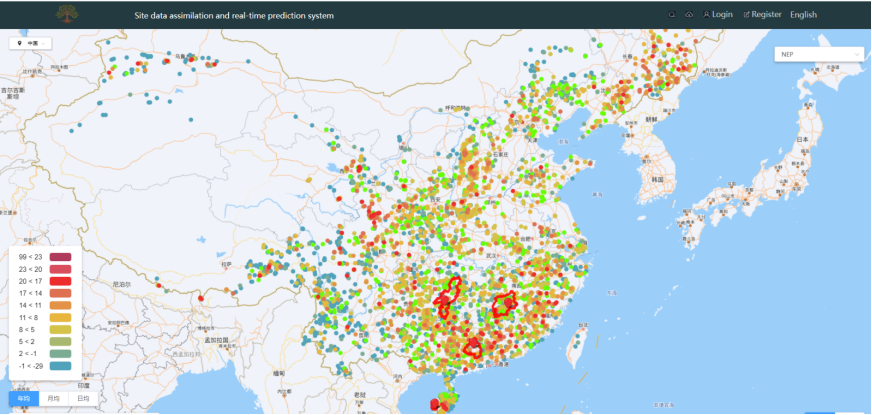
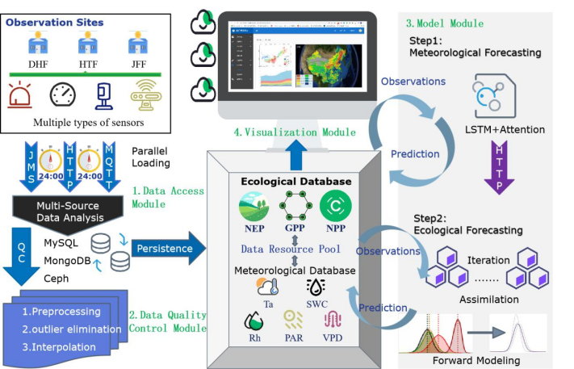
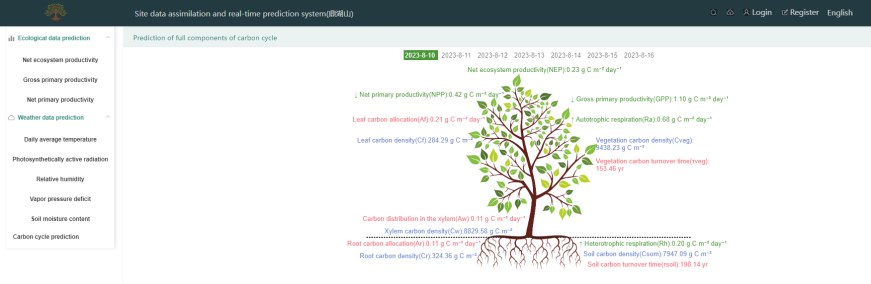
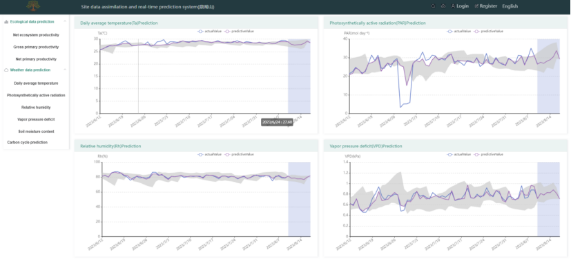

# CAFS 1.0: Terrestrial Ecosystem Carbon Cycle Assimilation and Forecasting System

## Introduction
CAFS 1.0 is an advanced system for near-term iterative prediction of terrestrial ecosystem carbon dynamics at site scale. This system integrates real-time meteorological and biometric observation data using data fusion and deep learning techniques. Successfully applied in four forest sites in China, CAFS 1.0 represents a breakthrough in ecological forecasting and ecosystem management.

## System Architecture
CAFS 1.0 is composed of a Vue.js frontend and a Java Spring Boot backend.

- **Frontend (Directory: `front`):** Interactive user interface developed with Vue.js for data visualization and user interaction.
- **Backend (Directory: `backend`):** Server-side application developed with Java Spring Boot for data processing and system logic.

## Prerequisites
- Node.js and npm (for frontend)
- Java JDK 8 or higher (for backend)

## Installation

### Frontend Setup
1. Clone the repository and navigate to the frontend directory:
   ```
   git clone https://github.com/damonwan1/CAFS1.0.git
   cd CAFS1.0/front
   ```
2. Install the required npm packages:
   ```
   npm install
   ```
3. Run the Vue.js application:
   ```
   npm run serve
   ```

### Backend Setup
1. Navigate to the backend directory:
   ```
   cd ../backend
   ```
2. Build the Spring Boot application (ensure you have Java JDK installed):
   ```
   ./mvnw clean install
   ```
3. Run the Spring Boot application:
   ```
   ./mvnw spring-boot:run
   ```

## Usage
Provide instructions and examples on how to use the system. Include screenshots or code snippets if necessary.

## Contributing
Contributions to CAFS 1.0 are welcome. Please read `CONTRIBUTING.md` for our contribution guidelines and the process for submitting pull requests.

## License
This project is licensed under [LICENSE NAME] - see the `LICENSE` file for details.

## Acknowledgements
Extend thanks to collaborators, funding bodies, and contributors who have been instrumental in the development of CAFS 1.0.




